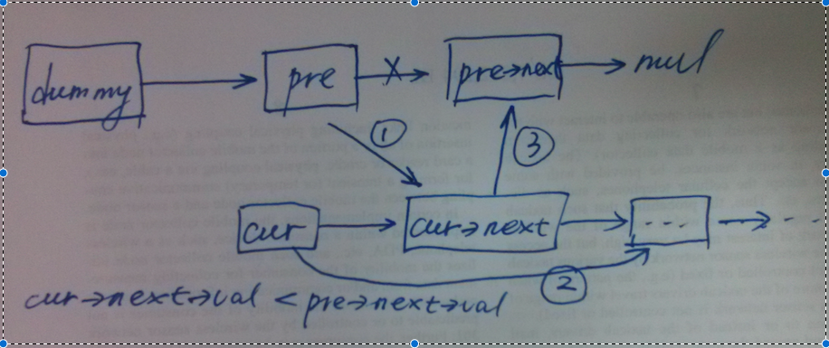

# Insertion Sort List

## Source

- leetcode: [Insertion Sort List | LeetCode OJ](https://leetcode.com/problems/insertion-sort-list/)
- lintcode: [(173) Insertion Sort List](http://www.lintcode.com/en/problem/insertion-sort-list/)

```
Sort a linked list using insertion sort.

Example
Given 1->3->2->0->null, return 0->1->2->3->null.
```

## 题解1 - 从首到尾遍历

插入排序常见的实现是针对数组的，如前几章总的的 [Insertion Sort](http://algorithm.yuanbin.me/zh-hans/basics_sorting/insertion_sort.html)，但这道题中的排序的数据结构为单向链表，故无法再从后往前遍历比较值的大小了。好在天无绝人之路，我们还可以**从前往后依次遍历比较和交换。**

由于排序后头节点不一定，故需要引入 dummy 大法，并以此节点的`next`作为最后返回结果的头节点，返回的链表从`dummy->next`这里开始构建。首先我们每次都从`dummy->next`开始遍历，依次和上一轮处理到的节点的值进行比较，直至找到不小于上一轮节点值的节点为止，随后将上一轮节点插入到当前遍历的节点之前，依此类推。文字描述起来可能比较模糊，大家可以结合以下的代码在纸上分析下。

### Python

```python
"""
Definition of ListNode
class ListNode(object):

    def __init__(self, val, next=None):
        self.val = val
        self.next = next
"""
class Solution:
    """
    @param head: The first node of linked list.
    @return: The head of linked list.
    """
    def insertionSortList(self, head):
        dummy = ListNode(0)
        cur = head
        while cur is not None:
            pre = dummy
            while pre.next is not None and pre.next.val < cur.val:
                pre = pre.next
            temp = cur.next
            cur.next = pre.next
            pre.next = cur
            cur = temp
        return dummy.next
```

### C++

```c++
/**
 * Definition of ListNode
 * class ListNode {
 * public:
 *     int val;
 *     ListNode *next;
 *     ListNode(int val) {
 *         this->val = val;
 *         this->next = NULL;
 *     }
 * }
 */
class Solution {
public:
    /**
     * @param head: The first node of linked list.
     * @return: The head of linked list.
     */
    ListNode *insertionSortList(ListNode *head) {
        ListNode *dummy = new ListNode(0);
	ListNode *cur = head;
        while (cur != NULL) {
            ListNode *pre = dummy;
            while (pre->next != NULL && pre->next->val < cur->val) {
                pre = pre->next;
            }
            ListNode *temp = cur->next;
            cur->next = pre->next;
            pre->next = cur;
            cur = temp;
        }

        return dummy->next;
    }
};
```

### Java

```java
/**
 * Definition for singly-linked list.
 * public class ListNode {
 *     int val;
 *     ListNode next;
 *     ListNode(int x) { val = x; }
 * }
 */
public class Solution {
    public ListNode insertionSortList(ListNode head) {
        ListNode dummy = new ListNode(0);
        ListNode cur = head;
        while (cur != null) {
            ListNode pre = dummy;
            while (pre.next != null && pre.next.val < cur.val) {
                pre = pre.next;
            }
            ListNode temp = cur.next;
            cur.next = pre.next;
            pre.next = cur;
            cur = temp;
        }

        return dummy.next;
    }
}
```
### 源码分析

1. 新建 dummy 节点，用以处理最终返回结果中头节点不定的情况。
2. 以`cur`表示当前正在处理的节点，在从 dummy 开始遍历前保存`cur`的下一个节点作为下一轮的`cur`.
3. 以`pre`作为遍历节点，直到找到不小于`cur`值的节点为止。
4. 将`pre`的下一个节点`pre->next`链接到`cur->next`上，`cur`链接到`pre->next`, 最后将`cur`指向下一个节点。
5. 返回`dummy->next`最为最终头节点。

Python 的实现在 lintcode 上会提示 TLE, leetcode 上勉强通过，这里需要注意的是采用`if A is not None:`的效率要比`if A:`高，不然 leetcode 上也过不了。具体原因可参考 [Stack Overflow](http://stackoverflow.com/questions/7816363/if-a-vs-if-a-is-not-none) 上的讨论。

### 复杂度分析

最好情况：原链表已经有序，每得到一个新节点都需要 $$i$$ 次比较和一次交换, 时间复杂度为 $$1/2O(n^2) + O(n)$$, 使用了 dummy 和 pre, 空间复杂度近似为 $$O(1)$$.

最坏情况：原链表正好逆序，由于是单向链表只能从前往后依次遍历，交换和比较次数均为 $$1/2 O(n^2)$$, 总的时间复杂度近似为 $$O(n^2)$$, 空间复杂度同上，近似为 $$O(1)$$.

## 题解2 - 优化有序链表

从题解1的复杂度分析可以看出其在最好情况下时间复杂度都为 $$O(n^2)$$ ，这显然是需要优化的。 仔细观察可发现最好情况下的比较次数 是可以优化到 $$O(n)$$ 的。思路自然就是先判断链表是否有序，仅对降序的部分进行处理。优化之后的代码就没题解1那么容易写对了，建议画个图自行纸上分析下。

### Python

```python
"""
Definition of ListNode
class ListNode(object):

    def __init__(self, val, next=None):
        self.val = val
        self.next = next
"""
class Solution:
    """
    @param head: The first node of linked list.
    @return: The head of linked list.
    """
    def insertionSortList(self, head):
        dummy = ListNode(0)
        dummy.next = head
        cur = head
        while cur is not None:
            if cur.next is not None and cur.next.val < cur.val:
                # find insert position for smaller(cur->next)
                pre = dummy
                while pre.next is not None and pre.next.val < cur.next.val:
                    pre = pre.next
                # insert cur->next after pre
                temp = pre.next
                pre.next = cur.next
                cur.next = cur.next.next
                pre.next.next = temp
            else:
                cur = cur.next
        return dummy.next
```

### C++

```c++
/**
 * Definition of ListNode
 * class ListNode {
 * public:
 *     int val;
 *     ListNode *next;
 *     ListNode(int val) {
 *         this->val = val;
 *         this->next = NULL;
 *     }
 * }
 */
class Solution {
public:
    /**
     * @param head: The first node of linked list.
     * @return: The head of linked list.
     */
    ListNode *insertionSortList(ListNode *head) {
        ListNode *dummy = new ListNode(0);
        dummy->next = head;
	ListNode *cur = head;
        while (cur != NULL) {
            if (cur->next != NULL && cur->next->val < cur->val) {
                ListNode *pre = dummy;
                // find insert position for smaller(cur->next)
                while (pre->next != NULL && pre->next->val <= cur->next->val) {
                    pre = pre->next;
                }
                // insert cur->next after pre
                ListNode *temp = pre->next;
                pre->next = cur->next;
                cur->next = cur->next->next;
                pre->next->next = temp;
            } else {
                cur = cur->next;
            }
        }

        return dummy->next;
    }
};
```

### Java

```java
/**
 * Definition for singly-linked list.
 * public class ListNode {
 *     int val;
 *     ListNode next;
 *     ListNode(int x) { val = x; }
 * }
 */
public class Solution {
    public ListNode insertionSortList(ListNode head) {
        ListNode dummy = new ListNode(0);
        dummy.next = head;
        ListNode cur = head;
        while (cur != null) {
            if (cur.next != null && cur.next.val < cur.val) {
                // find insert position for smaller(cur->next)
                ListNode pre = dummy;
                while (pre.next != null && pre.next.val < cur.next.val) {
                    pre = pre.next;
                }
                // insert cur->next after pre
                ListNode temp = pre.next;
                pre.next = cur.next;
                cur.next = cur.next.next;
                pre.next.next = temp;
            } else {
                cur = cur.next;
            }
        }

        return dummy.next;
    }
}
```

### 源码分析

1. 新建 dummy 节点并将其`next` 指向`head`
2. 分情况讨论，仅需要处理逆序部分。
3. 由于已经确认链表逆序，故仅需将较小值(`cur->next`而不是`cur`)的节点插入到链表的合适位置。
4. 将`cur->next`插入到`pre`之后，这里需要四个步骤，需要特别小心！



如上图所示，将`cur->next`插入到`pre`节点后大致分为3个步骤。

### 复杂度分析

最好情况下时间复杂度降至 $$O(n)$$, 其他同题解1.

## Reference

- [Explained C++ solution (24ms) - Leetcode Discuss](https://leetcode.com/discuss/37574/explained-c-solution-24ms)
- [Insertion Sort List - 九章算法](http://www.jiuzhang.com/solutions/insertion-sort-list/)
